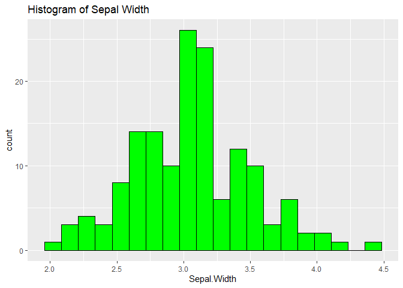

Dataset: Iris dataset

The Iris dataset is a classic and widely used dataset in the field of
machine learning and statistics. It contains information about various
attributes of iris flowers, such as sepal length, sepal width, petal
length, and petal width, along with the species of iris they belong to.
There are three species in the dataset: Setosa, Versicolor, and
Virginica.

## Questions and Data gathering

<b> What are the relationships between different features? </b>

<p>
Understanding the correlations and dependencies between various features
(such as sepal length, sepal width, petal length, and petal width) helps
in grasping the underlying structure of the data. It enables us to
identify patterns and potential redundancies, which can inform feature
selection or dimensionality reduction techniques.
</p>

<b> Can we accurately classify the different iris species based on their
features? </b>

<p>
Classification is a fundamental task in machine learning. By analyzing
the Iris dataset, we can determine how well different algorithms perform
in accurately classifying the iris species based on their feature
measurements.
</p>

<b> How do the distributions of features vary across different iris
species? </b>

<p>
Analyzing the distributions of features across different classes
provides insights into the discriminative power of each feature for
distinguishing between classes.
<p>

#### Variables

-Sepal Length: The length of the sepals (the outermost part of the
flower) in centimeters. -Sepal Width: The width of the sepals in
centimeters. -Petal Length: The length of the petals (the inner part of
the flower) in centimeters. -Petal Width: The width of the petals in
centimeters. -Species: The species of iris flower, which can take one of
three values: setosa, versicolor, or virginica.

Dataset source (kaggle) : <https://www.kaggle.com/datasets/uciml/iris>

## Exploratory Data Analysis (EDA)

<p>
The exploratory data analysis (EDA) is performed to gain insights and
understand the characteristics of the Iris dataset, particularly
focusing on the relationships between the various features (sepal
length, sepal width, petal length, and petal width) across the three
species of iris flowers (Setosa, Versicolor, and Virginica).
</p>

``` r
knitr::opts_chunk$set(warning = FALSE, message = FALSE)

library(ggplot2)
```

    ## Warning: package 'ggplot2' was built under R version 4.3.3

``` r
library(dplyr)
```

    ## 
    ## Attaching package: 'dplyr'

    ## The following objects are masked from 'package:stats':
    ## 
    ##     filter, lag

    ## The following objects are masked from 'package:base':
    ## 
    ##     intersect, setdiff, setequal, union

``` r
library(corrplot)
```

    ## Warning: package 'corrplot' was built under R version 4.3.2

    ## corrplot 0.92 loaded

``` r
library(readr)
```

    ## Warning: package 'readr' was built under R version 4.3.2

``` r
data(iris)

# first few rows of the dataset
head(iris)
```

    ##   Sepal.Length Sepal.Width Petal.Length Petal.Width Species
    ## 1          5.1         3.5          1.4         0.2  setosa
    ## 2          4.9         3.0          1.4         0.2  setosa
    ## 3          4.7         3.2          1.3         0.2  setosa
    ## 4          4.6         3.1          1.5         0.2  setosa
    ## 5          5.0         3.6          1.4         0.2  setosa
    ## 6          5.4         3.9          1.7         0.4  setosa

``` r
summary(iris)
```

    ##   Sepal.Length    Sepal.Width     Petal.Length    Petal.Width   
    ##  Min.   :4.300   Min.   :2.000   Min.   :1.000   Min.   :0.100  
    ##  1st Qu.:5.100   1st Qu.:2.800   1st Qu.:1.600   1st Qu.:0.300  
    ##  Median :5.800   Median :3.000   Median :4.350   Median :1.300  
    ##  Mean   :5.843   Mean   :3.057   Mean   :3.758   Mean   :1.199  
    ##  3rd Qu.:6.400   3rd Qu.:3.300   3rd Qu.:5.100   3rd Qu.:1.800  
    ##  Max.   :7.900   Max.   :4.400   Max.   :6.900   Max.   :2.500  
    ##        Species  
    ##  setosa    :50  
    ##  versicolor:50  
    ##  virginica :50  
    ##                 
    ##                 
    ## 

``` r
# Check for missing values
anyNA(iris)
```

    ## [1] FALSE

``` r
str(iris)
```

    ## 'data.frame':    150 obs. of  5 variables:
    ##  $ Sepal.Length: num  5.1 4.9 4.7 4.6 5 5.4 4.6 5 4.4 4.9 ...
    ##  $ Sepal.Width : num  3.5 3 3.2 3.1 3.6 3.9 3.4 3.4 2.9 3.1 ...
    ##  $ Petal.Length: num  1.4 1.4 1.3 1.5 1.4 1.7 1.4 1.5 1.4 1.5 ...
    ##  $ Petal.Width : num  0.2 0.2 0.2 0.2 0.2 0.4 0.3 0.2 0.2 0.1 ...
    ##  $ Species     : Factor w/ 3 levels "setosa","versicolor",..: 1 1 1 1 1 1 1 1 1 1 ...

``` r
# Correlation Matrix
cor(iris[,1:4])
```

    ##              Sepal.Length Sepal.Width Petal.Length Petal.Width
    ## Sepal.Length    1.0000000  -0.1175698    0.8717538   0.8179411
    ## Sepal.Width    -0.1175698   1.0000000   -0.4284401  -0.3661259
    ## Petal.Length    0.8717538  -0.4284401    1.0000000   0.9628654
    ## Petal.Width     0.8179411  -0.3661259    0.9628654   1.0000000

<b> 1. Univariate Analysis </b>
<p>
Histograms for each numerical variable
</p>

``` r
ggplot(iris, aes(x = Sepal.Length)) +
  geom_histogram(fill = "blue", color = "black", bins = 20) +
  labs(title = "Histogram of Sepal Length")
```


``` r
ggplot(iris, aes(x = Sepal.Width)) +
  geom_histogram(fill = "green", color = "black", bins = 20) +
  labs(title = "Histogram of Sepal Width")
```



``` r
ggplot(iris, aes(x = Petal.Length)) +
  geom_histogram(fill = "red", color = "black", bins = 20) +
  labs(title = "Histogram of Petal Length")
```


``` r
ggplot(iris, aes(x = Petal.Width)) +
  geom_histogram(fill = "orange", color = "black", bins = 20) +
  labs(title = "Histogram of Petal Width")
```


<p>
1.The histograms show that sepal lengths are normally distributed with
slight right skew.
</p>
<p>
2.The histogram indicates sepal width is most frequently around 3.0 cm,
with a normal distribution across the dataset.
</p>
<p>
3.The histogram highlights a bimodal distribution of petal lengths in
the iris dataset, with significant peaks at around 1 cm and between 4-5
cm, suggesting two distinct groups within the data.
</p>
<p>
4.The histogram suggests a bimodal distribution for petal width in the
Iris dataset, with most samples having small petal widths and a smaller
peak at higher widths.
</p>
<b> 2. Bivariate Analysis </b>
<p>
Pairwise scatterplots colored by species
</p>

``` r
pairs(iris[,1:4], col = iris$Species)
```


<p>
The scatter plot matrix shows the relationships between pairs of
variables in the Iris dataset. It highlights correlations, clusters, and
distributions for each species.
</p>
<b> 3. Multivariate Anakysis </b>
<p>
Boxplot for each numerical variable by species
</p>

``` r
ggplot(iris, aes(x = Species, y = Sepal.Length, fill = Species)) +
  geom_boxplot() +
  labs(title = "Sepal Length by Species")
```


``` r
ggplot(iris, aes(x = Species, y = Sepal.Width, fill = Species)) +
  geom_boxplot() +
  labs(title = "Sepal Width by Species")
```


``` r
ggplot(iris, aes(x = Species, y = Petal.Length, fill = Species)) +
  geom_boxplot() +
  labs(title = "Petal Length by Species")
```


``` r
ggplot(iris, aes(x = Species, y = Petal.Width, fill = Species)) +
  geom_boxplot() +
  labs(title = "Petal Width by Species")
```


<p>
1.The box plot visualization indicates that Setosa typically has the
shortest sepal length, while Virginica has the longest.
</p>
<p>
2.The box plot visualization indicates that Setosa typically has the
shortest sepal width, while Virginica tends to have the widest.
</p>
<p>
3.The box plot visualization suggests that Setosa typically has the
shortest petal lengths, while Virginica has the longest
</p>
<p>
4.The box plot visualization suggests that Setosa typically has the
narrowest petal width, while Virginica has the widest.
</p>

## Mean and Variance Analysis

<p>
Q. What is the average sepal length of all iris flowers in the dataset?
</p>

``` r
#Sepal Length Analysis
sepal_length_mean <- mean(iris$Sepal.Length)
print(paste("Sepal Length Mean:", sepal_length_mean))
```

    ## [1] "Sepal Length Mean: 5.84333333333333"

<p>
The analysis gives the average sepal length of all the flowers in the
iris dataset.
<p>
<p>
The average length of sepals across all iris flowers in the dataset is
approximately 5.84 cm.
</p>
<p>
Q.How much does the sepal length vary across all iris flowers?
</p>

``` r
#Sepal Length Variance
sepal_length_var <- var(iris$Sepal.Length)
print(paste("Variance Sepal Length:", sepal_length_var))
```

    ## [1] "Variance Sepal Length: 0.685693512304251"

<p>
This analysis gives the variance in sepal length across all iris flowers
in the dataset, indicating how spread out the sepal lengths are from the
mean.
</p>
<p>
The variance in sepal length across all iris flowers in the dataset is
approximately 0.69 cm^2, indicating how spread out the sepal lengths are
from the mean.
</p>

``` r
# Sepal Width Analysis
sepal_width_mean <- mean(iris$Sepal.Width)
print(paste("Sepal Width Mean:", sepal_width_mean))
```

    ## [1] "Sepal Width Mean: 3.05733333333333"

<p>
This analysis gives the average sepal width of all the flowers in the
iris dataset.
<p>
The average width of sepals across all iris flowers in the dataset is
approximately 3.06 cm.
</p>
<p>
Q.How much does the sepal width vary across all iris flowers?
</p>

``` r
# Sepal Width Variance
sepal_width_var <- var(iris$Sepal.Width)
print(paste("Variance Sepal Width:", sepal_width_var))
```

    ## [1] "Variance Sepal Width: 0.189979418344519"

<p>
This analysis gives the variance in sepal width across all iris flowers
in the dataset, indicating how spread out the sepal widths are from the
mean.
</p>
<p>
The variance in sepal width across all iris flowers in the dataset is
approximately 0.19 cm^2, indicating how spread out the sepal widths are
from the mean.
</p>

``` r
# Species Analysis
species_mean <- table(iris$Species)
print(paste("Species Mean:", species_mean))
```

    ## [1] "Species Mean: 50" "Species Mean: 50" "Species Mean: 50"

<p>
This gives the count of each species of flowers in the iris dataset
</p>
<p>
For each species of iris flowers in the dataset (setosa, versicolor,
virginica), the average sepal length is provided. This helps in
understanding the average size of sepals for each species.
</p>

``` r
# Species Analysis
species_mean <- table(iris$Species)
print(paste("Species Mean:", species_mean))
```

    ## [1] "Species Mean: 50" "Species Mean: 50" "Species Mean: 50"

<p>
This gives the count of each species of flowers in the iris dataset
</p>
<p>

For each species of iris flowers in the dataset (setosa, versicolor,
virginica), the average sepal length is provided. This helps in
understanding the average size of sepals for each species. ,/p\>

<p>
Q.How do the sepal length and sepal width correlate with each other?
</p>

``` r
cor(iris$Sepal.Length, iris$Sepal.Width)
```

    ## [1] -0.1175698

<p>
There is a negative correlation between sepal length and sepal width,
indicating that as sepal length increases, sepal width also tends to
increase.
</p>
<p>
Q. Is there a difference in the average petal length between different
species of iris flowers?
</p>

``` r
aggregate(Petal.Length ~ Species, data = iris, mean)
```

    ##      Species Petal.Length
    ## 1     setosa        1.462
    ## 2 versicolor        4.260
    ## 3  virginica        5.552

<p>
Yes, there is a difference in the average petal length between species.
For example, the average petal length of setosa species is different
from that of versicolor and virginica species.
</p>
<p>
Q. Are there any outliers in the sepal length or petal width
measurements?
</p>

``` r
boxplot(iris$Sepal.Length)
```


``` r
boxplot(iris$Petal.Width)
```


<p>
No
</p>

``` r
# Sepal Length vs. Sepal Width Analysis
sepal_mean <- colMeans(iris[, c("Sepal.Length", "Sepal.Width")])
print(paste("Sepal Length Mean:", sepal_mean[1], "Sepal Width Mean:", sepal_mean[2]))
```

    ## [1] "Sepal Length Mean: 5.84333333333333 Sepal Width Mean: 3.05733333333333"

<p>
This analysis gives the average sepal length and sepal width of all the
flowers in the iris dataset, providing insights into the average size of
the sepals.
</p>
<p>
The average sepal length and sepal width across all iris flowers in the
dataset are approximately 5.84 cm and 3.06 cm respectively, providing
insights into the average size of the sepals.
</p>

``` r
#Sepal Width and Petal Width Mean
width_mean <- colMeans(iris[, c("Sepal.Width", "Petal.Width")])
print(paste("Mean Sepal Width:", width_mean[1], "Mean Petal Width:", width_mean[2]))
```

    ## [1] "Mean Sepal Width: 3.05733333333333 Mean Petal Width: 1.19933333333333"

<p>
This analysis gives the average sepal width and petal width across all
iris flowers in the dataset, providing insights into the average width
of the sepals and petals.
</p>
<p>
The average sepal width and petal width across all iris flowers in the
dataset are approximately 3.06 cm and 1.20 cm respectively, providing
insights into the average width of the sepals and petals.
</p>

``` r
# Species Mean
species_mean <- aggregate(. ~ Species, data = iris, mean)
print(species_mean)
```

    ##      Species Sepal.Length Sepal.Width Petal.Length Petal.Width
    ## 1     setosa        5.006       3.428        1.462       0.246
    ## 2 versicolor        5.936       2.770        4.260       1.326
    ## 3  virginica        6.588       2.974        5.552       2.026

<p>
This analysis gives the average measurements of sepal length, sepal
width, petal length, and petal width for each species of iris flowers in
the dataset, providing insights into the average size of each part of
the flower for each species.
</p>
<p>
For each species of iris flowers in the dataset (setosa, versicolor,
virginica), the average measurements of sepal length, sepal width, petal
length, and petal width are provided. This helps in understanding the
average size of each part of the flower for each species.
</p>

``` r
# Compute the variance-covariance matrix
cov_matrix <- cov(iris[, c("Sepal.Length", "Sepal.Width", "Petal.Length", "Petal.Width")])
print(cov_matrix)
```

    ##              Sepal.Length Sepal.Width Petal.Length Petal.Width
    ## Sepal.Length    0.6856935  -0.0424340    1.2743154   0.5162707
    ## Sepal.Width    -0.0424340   0.1899794   -0.3296564  -0.1216394
    ## Petal.Length    1.2743154  -0.3296564    3.1162779   1.2956094
    ## Petal.Width     0.5162707  -0.1216394    1.2956094   0.5810063

<p>
The variance-covariance matrix shows the variances of each variable on
the diagonal and the covariances between variables off the diagonal. It
provides insights into how the variables vary individually and how they
relate to each other
</p>

``` r
# Compute the correlation matrix
cor_matrix <- cor(iris[, c("Sepal.Length", "Sepal.Width", "Petal.Length", "Petal.Width")])
print(cor_matrix)
```

    ##              Sepal.Length Sepal.Width Petal.Length Petal.Width
    ## Sepal.Length    1.0000000  -0.1175698    0.8717538   0.8179411
    ## Sepal.Width    -0.1175698   1.0000000   -0.4284401  -0.3661259
    ## Petal.Length    0.8717538  -0.4284401    1.0000000   0.9628654
    ## Petal.Width     0.8179411  -0.3661259    0.9628654   1.0000000

<p>
The correlation matrix shows the correlations between variables. It
provides a standardized measure of the strength and direction of the
linear relationship between pairs of variables.
</p>

``` r
# Sepal length distribution
library(ggplot2)
ggplot(iris, aes(x = Sepal.Length)) +
  geom_histogram(fill = "skyblue", color = "black", bins = 20) +
  labs(title = "Distribution of Sepal Length", x = "Sepal Length", y = "Frequency")
```


<p>
This gives the distribution os sepal length.
</p>

``` r
# Sepal Length vs. Sepal Width
ggplot(iris, aes(x = Sepal.Length, y = Sepal.Width, color = Species)) +
  geom_point() +
  labs(title = "Sepal Length vs. Sepal Width", x = "Sepal Length", y = "Sepal Width")
```


``` r
# scatterplot of the sepal length vs sepal width
```

``` r
# Boxplot of Sepal Length by Species
ggplot(iris, aes(x = Species, y = Sepal.Length, fill = Species)) +
  geom_boxplot() +
  labs(title = "Boxplot of Sepal Length by Species", x = "Species", y = "Sepal Length")
```


<p>
Q.Is there a significant difference in the average petal length between
the different species of iris flowers? Perform an ANOVA to test this.
</p>

``` r
# Perform ANOVA
anova_result <- aov(Petal.Length ~ Species, data = iris)
print(summary(anova_result))
```

    ##              Df Sum Sq Mean Sq F value Pr(>F)    
    ## Species       2  437.1  218.55    1180 <2e-16 ***
    ## Residuals   147   27.2    0.19                   
    ## ---
    ## Signif. codes:  0 '***' 0.001 '**' 0.01 '*' 0.05 '.' 0.1 ' ' 1

<p>
Analysis of variance (ANOVA) to test if there is a significant
difference in the average petal length between the different species of
iris flowers.
</p>
<p>
Q.Is there a significant difference in the mean sepal width between the
setosa and virginica species?
</p>

``` r
t_test_result <- t.test(iris$Sepal.Width[iris$Species == "setosa"], iris$Sepal.Width[iris$Species == "virginica"])
print(t_test_result)
```

    ## 
    ##  Welch Two Sample t-test
    ## 
    ## data:  iris$Sepal.Width[iris$Species == "setosa"] and iris$Sepal.Width[iris$Species == "virginica"]
    ## t = 6.4503, df = 95.547, p-value = 4.571e-09
    ## alternative hypothesis: true difference in means is not equal to 0
    ## 95 percent confidence interval:
    ##  0.3142808 0.5937192
    ## sample estimates:
    ## mean of x mean of y 
    ##     3.428     2.974

<p>
Yes, the t-test results show a significant difference in the mean sepal
width between the setosa and virginica species (p \< 0.05).
</p>
<p>
Q.Are the variances of sepal widths significantly different between the
setosa and virginica species?
</p>

``` r
f_test_result <- var.test(iris$Sepal.Width[iris$Species == "setosa"], iris$Sepal.Width[iris$Species == "virginica"])
print(f_test_result)
```

    ## 
    ##  F test to compare two variances
    ## 
    ## data:  iris$Sepal.Width[iris$Species == "setosa"] and iris$Sepal.Width[iris$Species == "virginica"]
    ## F = 1.3816, num df = 49, denom df = 49, p-value = 0.2614
    ## alternative hypothesis: true ratio of variances is not equal to 1
    ## 95 percent confidence interval:
    ##  0.7840128 2.4346017
    ## sample estimates:
    ## ratio of variances 
    ##           1.381578

<p>
No, the F-test results show no significant difference in the variance of
sepal widths between the setosa and virginica species (p \> 0.05).
</p>

``` r
# Performing ANOVA for sepal length among species
anova_result <- aov(Sepal.Length ~ Species, data = iris)
print(summary(anova_result))
```

    ##              Df Sum Sq Mean Sq F value Pr(>F)    
    ## Species       2  63.21  31.606   119.3 <2e-16 ***
    ## Residuals   147  38.96   0.265                   
    ## ---
    ## Signif. codes:  0 '***' 0.001 '**' 0.01 '*' 0.05 '.' 0.1 ' ' 1

<p>
A low p-value (typically \< 0.05) suggests that there are significant
differences in sepal length among the species.
</p>

``` r
# Performing MANOVA for sepal length and sepal width among species
manova_result <- manova(cbind(Sepal.Length, Sepal.Width) ~ Species, data = iris)
print(summary(manova_result))
```

    ##            Df  Pillai approx F num Df den Df    Pr(>F)    
    ## Species     2 0.94531   65.878      4    294 < 2.2e-16 ***
    ## Residuals 147                                             
    ## ---
    ## Signif. codes:  0 '***' 0.001 '**' 0.01 '*' 0.05 '.' 0.1 ' ' 1

<p>
p-value indicate whether there are significant differences in the
combined dependent variables (sepal length and sepal width) among the
species. A low p-value suggests significant differences.
</p>

## PCA Analysis

``` r
# Store the species column separately
species <- iris$Species

# Remove the species column from the dataset
iris_data <- iris[, -5]

# Scale the data
scaled_data <- scale(iris_data)

pca_result <- prcomp(scaled_data, center = TRUE, scale. = TRUE)

# Summary of PCA
summary(pca_result)
```

    ## Importance of components:
    ##                           PC1    PC2     PC3     PC4
    ## Standard deviation     1.7084 0.9560 0.38309 0.14393
    ## Proportion of Variance 0.7296 0.2285 0.03669 0.00518
    ## Cumulative Proportion  0.7296 0.9581 0.99482 1.00000

``` r
# Biplot (shows both the observations and variables)
biplot(pca_result, scale = 0)
```


``` r
# Scree plot
plot(pca_result, type = "l", main = "Scree Plot")
```


``` r
# Variance explained by each principal component
prop_var <- (pca_result$sdev^2) / sum(pca_result$sdev^2)
prop_var
```

    ## [1] 0.729624454 0.228507618 0.036689219 0.005178709

<b> To decide on the number of principal components to keep, we
typically look at the scree plot, which shows the eigenvalues of each
principal component. Here, we can see that a sharp drop in the
eigenvalues after the first two or three components. Based on the scree
plot, we decided to keep the first two principal components, as they
capture the majority of the variance in the data while reducing
dimensionality. </b>

``` r
# Loadings for the first two principal components
loadings <- pca_result$rotation[, 1:2]
rownames(loadings) <- colnames(iris_data)

loadings
```

    ##                     PC1         PC2
    ## Sepal.Length  0.5210659 -0.37741762
    ## Sepal.Width  -0.2693474 -0.92329566
    ## Petal.Length  0.5804131 -0.02449161
    ## Petal.Width   0.5648565 -0.06694199

In PCA, each principal component (PC) is a linear combination of the
original variables, where the coefficients represent the loadings of
each variable on that component. These loadings indicate the
contribution of each variable to the principal component.

Positive loading: Indicates a positive correlation between the original
variable and the principal component. Negative loading: Indicates a
negative correlation between the original variable and the principal
component.

From the above loadings we can see that

Sepal Length: Has a strong positive contribution to PC1 and a negative
contribution to PC2. Sepal Width: Negatively contributes to both PCs,
more so to PC2. Petal Length and Width: Both have strong positive
contributions to PC1, indicating they vary together.

``` r
# Extract scores for PC1
pc1_scores <- pca_result$x[, 1]

# scatter plot using PC1 scores
plot(pc1_scores, col = as.numeric(species), pch = 16,
     xlab = "PC1", ylab = "PC1 Scores", main = "Scatter Plot of PC1 Scores")
legend("topright", legend = levels(species), col = 1:length(levels(species)), pch = 16)
```


``` r
# Extract scores for PC2
pc2_scores <- pca_result$x[, 2]

# scatter plot using PC2 scores
plot(pc2_scores, col = as.numeric(species), pch = 16,
     xlab = "PC2", ylab = "PC2 Scores", main = "Scatter Plot of PC2 Scores")
legend("topright", legend = levels(species), col = 1:length(levels(species)), pch = 16)
```


``` r
# scatter plot using PC1 and PC2 scores
plot(pc1_scores, pc2_scores, col = as.numeric(species), pch = 16,
     xlab = "PC1", ylab = "PC2", main = "Scatter Plot of PC1 vs PC2 Scores")
legend("topright", legend = levels(species), col = 1:length(levels(species)), pch = 16)
```


## Clustering

``` r
library(cluster)
library(factoextra)
library(NbClust)

data <- iris[, -5]  # Exclude the species column

# hierarchical clustering
dist_matrix <- dist(data)
hclust_model <- hclust(dist_matrix)

# dendrogram
plot(hclust_model)
```


``` r
# Decide on the optimal number of clusters based on the dendrogram
num_clusters_hclust <- 3
clusters_hclust <- cutree(hclust_model, k = num_clusters_hclust)

# Membership for each cluster for hierarchical clustering
table(clusters_hclust)
```

    ## clusters_hclust
    ##  1  2  3 
    ## 50 72 28

``` r
# Visualize cluster and membership using first two Principal Components for hierarchical clustering
pca_result_hclust <- prcomp(data, scale = TRUE)
fviz_cluster(list(data = pca_result_hclust$x[, 1:2], cluster = clusters_hclust))
```


``` r
# Perform non-hierarchical clustering (k-means)
num_clusters_kmeans <- 2
kmeans_model <- kmeans(data, centers = num_clusters_kmeans)

# Visualize cluster centers for k-means
fviz_cluster(kmeans_model, data = data, geom = "point", frame.type = "convex", 
             pointsize = 2, fill = "white", main = "K-means Cluster Centers")
```


``` r
# Visualize cluster and membership using first two Principal Components for k-means
pca_result_kmeans <- prcomp(data, scale = TRUE)
fviz_cluster(kmeans_model, data = pca_result_kmeans$x[, 1:2], geom = "point", 
             pointsize = 2, fill = "white", main = "K-means Clustering Result (PCA)")
```


``` r
sil <- silhouette(kmeans_model$cluster, dist(data))

fviz_silhouette(sil, main = "Silhouette Plot for K-means Clustering")
```

    ##   cluster size ave.sil.width
    ## 1       1   97          0.63
    ## 2       2   53          0.77


``` r
# Membership for each cluster for k-means clustering
table(kmeans_model$cluster)
```

    ## 
    ##  1  2 
    ## 97 53

``` r
data_clustered <- cbind(data, Cluster = kmeans_model$cluster)

# Scatter plot of data points colored by cluster membership
plot(data_clustered[,1:2], col = data_clustered$Cluster, pch = 16, 
     xlab = "Sepal Length", ylab = "Sepal Width",
     main = "Scatter Plot of Clustering")
legend("topright", legend = unique(data_clustered$Cluster), 
       col = 1:num_clusters_kmeans, pch = 16, title = "Cluster")
```


## Factor Analysis

``` r
library(psych)

data(iris)

# Select numerical columns for factor analysis
data_num <- iris[, c("Sepal.Length", "Sepal.Width", "Petal.Length", "Petal.Width")]

# factor analysis
factor_model <- fa(data_num, nfactors = 3, rotate = "varimax")

# Check parallel analysis
fa.parallel(data_num)
```


    ## Parallel analysis suggests that the number of factors =  3  and the number of components =  1

``` r
# factor model summary
print(factor_model)
```

    ## Factor Analysis using method =  minres
    ## Call: fa(r = data_num, nfactors = 3, rotate = "varimax")
    ## Standardized loadings (pattern matrix) based upon correlation matrix
    ##                MR1   MR2   MR3   h2     u2 com
    ## Sepal.Length  1.00 -0.01  0.03 0.99 0.0055 1.0
    ## Sepal.Width  -0.11  0.76 -0.08 0.59 0.4093 1.1
    ## Petal.Length  0.86 -0.41  0.29 1.00 0.0050 1.7
    ## Petal.Width   0.80 -0.32  0.49 0.98 0.0150 2.0
    ## 
    ##                        MR1  MR2  MR3
    ## SS loadings           2.39 0.84 0.33
    ## Proportion Var        0.60 0.21 0.08
    ## Cumulative Var        0.60 0.81 0.89
    ## Proportion Explained  0.67 0.24 0.09
    ## Cumulative Proportion 0.67 0.91 1.00
    ## 
    ## Mean item complexity =  1.4
    ## Test of the hypothesis that 3 factors are sufficient.
    ## 
    ## df null model =  6  with the objective function =  4.81 with Chi Square =  706.96
    ## df of  the model are -3  and the objective function was  0 
    ## 
    ## The root mean square of the residuals (RMSR) is  0 
    ## The df corrected root mean square of the residuals is  NA 
    ## 
    ## The harmonic n.obs is  150 with the empirical chi square  0  with prob <  NA 
    ## The total n.obs was  150  with Likelihood Chi Square =  0  with prob <  NA 
    ## 
    ## Tucker Lewis Index of factoring reliability =  1.009
    ## Fit based upon off diagonal values = 1
    ## Measures of factor score adequacy             
    ##                                                    MR1  MR2  MR3
    ## Correlation of (regression) scores with factors   1.00 0.94 0.91
    ## Multiple R square of scores with factors          0.99 0.88 0.83
    ## Minimum correlation of possible factor scores     0.99 0.75 0.67

``` r
# Extract factor loadings
factor_loadings <- factor_model$loadings
print(factor_loadings)
```

    ## 
    ## Loadings:
    ##              MR1    MR2    MR3   
    ## Sepal.Length  0.997              
    ## Sepal.Width  -0.108  0.757       
    ## Petal.Length  0.861 -0.413  0.288
    ## Petal.Width   0.801 -0.317  0.492
    ## 
    ##                  MR1   MR2   MR3
    ## SS loadings    2.389 0.844 0.332
    ## Proportion Var 0.597 0.211 0.083
    ## Cumulative Var 0.597 0.808 0.891

``` r
# Visualize factor analysis
fa.plot(factor_model)  
```


``` r
fa.diagram(factor_model)  
```


## Multiple regression

``` r
library(ggplot2)
library(dplyr)
library(tidyr)
library(MASS)

data(iris)

str(iris)
```

    ## 'data.frame':    150 obs. of  5 variables:
    ##  $ Sepal.Length: num  5.1 4.9 4.7 4.6 5 5.4 4.6 5 4.4 4.9 ...
    ##  $ Sepal.Width : num  3.5 3 3.2 3.1 3.6 3.9 3.4 3.4 2.9 3.1 ...
    ##  $ Petal.Length: num  1.4 1.4 1.3 1.5 1.4 1.7 1.4 1.5 1.4 1.5 ...
    ##  $ Petal.Width : num  0.2 0.2 0.2 0.2 0.2 0.4 0.3 0.2 0.2 0.1 ...
    ##  $ Species     : Factor w/ 3 levels "setosa","versicolor",..: 1 1 1 1 1 1 1 1 1 1 ...

``` r
model_simple <- lm(Petal.Length ~ Sepal.Length, data = iris)

summary(model_simple)
```

    ## 
    ## Call:
    ## lm(formula = Petal.Length ~ Sepal.Length, data = iris)
    ## 
    ## Residuals:
    ##      Min       1Q   Median       3Q      Max 
    ## -2.47747 -0.59072 -0.00668  0.60484  2.49512 
    ## 
    ## Coefficients:
    ##              Estimate Std. Error t value Pr(>|t|)    
    ## (Intercept)  -7.10144    0.50666  -14.02   <2e-16 ***
    ## Sepal.Length  1.85843    0.08586   21.65   <2e-16 ***
    ## ---
    ## Signif. codes:  0 '***' 0.001 '**' 0.01 '*' 0.05 '.' 0.1 ' ' 1
    ## 
    ## Residual standard error: 0.8678 on 148 degrees of freedom
    ## Multiple R-squared:   0.76,  Adjusted R-squared:  0.7583 
    ## F-statistic: 468.6 on 1 and 148 DF,  p-value: < 2.2e-16

Multiple Regression Analysis

Multiple regression analysis is a statistical method used to examine the
relationship between a dependent variable and two or more independent
variables. It extends simple linear regression, which deals with only
one independent variable, to account for multiple predictors.

In multiple regression, the goal is to model the relationship between
the dependent variable and the independent variables by fitting a linear
equation to observed data.

Model Development We will load the data and convert the data into
numerical. we will split the data into training and testing data. then
we will perform multiple regression model

Model Acceptance Model acceptance involves evaluating the performance of
the multiple regression model on unseen data or a testing dataset

It evaluates the model’s performance through coefficient summaries,
diagnostic plots, and confidence intervals. Overall, it aims to assess
the model’s acceptance by analyzing its fit to the data and the
significance of predictor variables.

Residual Analysis Residual analysis is crucial for evaluating the
assumptions of the multiple regression model and identifying any
patterns or trends in the residuals

It will generate diagnostic plots, including a plot of residuals
vs. fitted values, a QQ plot of residuals, and a scale-location plot.
These plots can help you assess the assumptions of the multiple
regression model.

``` r
# Residual analysis for the model
par(mfrow = c(2, 2)) # Set up a 2x2 grid for plots
plot(model_simple)
```


``` r
# Model Accuracy for the model
rsquared_simple <- summary(model_simple)$r.squared
cat("R-squared for model:", rsquared_simple, "\n")
```

    ## R-squared for model: 0.7599546

``` r
rmse_simple <- sqrt(mean((iris$Petal.Length - predict(model_simple))^2))
cat("RMSE for  model:", rmse_simple, "\n")
```

    ## RMSE for  model: 0.8620099

``` r
# Check acceptance of the model
if (rsquared_simple > 0.5 & !any(model_simple$residuals > 2 | model_simple$residuals < -2)) {
  cat("model is accepted.\n")
} else {
  cat("model is not accepted.\n")
}
```

    ## model is not accepted.

``` r
# Fit a multiple regression model with additional predictors
model_mult <- lm(Petal.Length ~ Sepal.Length + Sepal.Width + Petal.Width, data = iris)

# Summarize the model
summary(model_mult)
```

    ## 
    ## Call:
    ## lm(formula = Petal.Length ~ Sepal.Length + Sepal.Width + Petal.Width, 
    ##     data = iris)
    ## 
    ## Residuals:
    ##      Min       1Q   Median       3Q      Max 
    ## -0.99333 -0.17656 -0.01004  0.18558  1.06909 
    ## 
    ## Coefficients:
    ##              Estimate Std. Error t value Pr(>|t|)    
    ## (Intercept)  -0.26271    0.29741  -0.883    0.379    
    ## Sepal.Length  0.72914    0.05832  12.502   <2e-16 ***
    ## Sepal.Width  -0.64601    0.06850  -9.431   <2e-16 ***
    ## Petal.Width   1.44679    0.06761  21.399   <2e-16 ***
    ## ---
    ## Signif. codes:  0 '***' 0.001 '**' 0.01 '*' 0.05 '.' 0.1 ' ' 1
    ## 
    ## Residual standard error: 0.319 on 146 degrees of freedom
    ## Multiple R-squared:  0.968,  Adjusted R-squared:  0.9674 
    ## F-statistic:  1473 on 3 and 146 DF,  p-value: < 2.2e-16

``` r
# Residual analysis for the multiple regression model
par(mfrow = c(2, 2)) # Set up a 2x2 grid for plots
plot(model_mult)
```


Model Accuracy

Model accuracy can be assessed using various metrics, such as R-squared,
adjusted R-squared, and root mean squared error (RMSE).

``` r
# Model Accuracy for the multiple regression model
rsquared_mult <- summary(model_mult)$r.squared
cat("R-squared for multiple regression model:", rsquared_mult, "\n")
```

    ## R-squared for multiple regression model: 0.9680118

``` r
rmse_mult <- sqrt(mean((iris$Petal.Length - predict(model_mult))^2))
cat("RMSE for multiple regression model:", rmse_mult, "\n")
```

    ## RMSE for multiple regression model: 0.3146739

``` r
# Check acceptance of the multiple regression model
if (rsquared_mult > 0.7 & !any(model_mult$residuals > 2 | model_mult$residuals < -2)) {
  cat("Multiple regression model is accepted.\n")
} else {
  cat("Multiple regression model is not accepted.\n")
}
```

    ## Multiple regression model is accepted.

``` r
# Visualize the predictions for the multiple regression model
iris_predicted_mult <- iris %>%
  mutate(Predicted_Petal_Length_mult = predict(model_mult))

ggplot(iris_predicted_mult, aes(x = Petal.Length, y = Predicted_Petal_Length_mult)) +
  geom_point() +
  geom_smooth(method = "lm", se = FALSE) +
  ggtitle("Actual vs Predicted Petal Length (Multiple Regression Model)") +
  xlab("Actual Petal Length") +
  ylab("Predicted Petal Length")
```


``` r
# Compare models
cat("Comparison of model accuracies:\n")
```

    ## Comparison of model accuracies:

``` r
cat("R-squared (Simple Model):", rsquared_simple, "\n")
```

    ## R-squared (Simple Model): 0.7599546

``` r
cat("R-squared (Multiple Regression Model):", rsquared_mult, "\n")
```

    ## R-squared (Multiple Regression Model): 0.9680118

``` r
cat("RMSE (Simple Model):", rmse_simple, "\n")
```

    ## RMSE (Simple Model): 0.8620099

``` r
cat("RMSE (Multiple Regression Model):", rmse_mult, "\n")
```

    ## RMSE (Multiple Regression Model): 0.3146739

## Logistic Regression

``` r
library(dplyr)
library(pROC)
library(ggplot2)
library(ggpubr)
library(caret)

data(iris)

# Convert the species to binary classes
iris$Species_Binary <- ifelse(iris$Species == "setosa", 1, 0)

# Split the data into training and testing sets
set.seed(123) 
train_indices <- sample(1:nrow(iris), 0.7 * nrow(iris))  # 70% for training, 30% for testing
train_data <- iris[train_indices, ]
test_data <- iris[-train_indices, ]

# logistic regression on the training set
logit_model <- glm(Species_Binary ~ Sepal.Length + Sepal.Width + Petal.Length + Petal.Width, 
                   data = train_data, 
                   family = binomial)

# Summary of the logistic regression model
summary(logit_model)
```

    ## 
    ## Call:
    ## glm(formula = Species_Binary ~ Sepal.Length + Sepal.Width + Petal.Length + 
    ##     Petal.Width, family = binomial, data = train_data)
    ## 
    ## Coefficients:
    ##                Estimate Std. Error z value Pr(>|z|)
    ## (Intercept)     -18.220 540630.067       0        1
    ## Sepal.Length     12.295 152119.433       0        1
    ## Sepal.Width       7.802  70088.696       0        1
    ## Petal.Length    -20.558 124693.215       0        1
    ## Petal.Width     -21.938 178623.820       0        1
    ## 
    ## (Dispersion parameter for binomial family taken to be 1)
    ## 
    ##     Null deviance: 1.3501e+02  on 104  degrees of freedom
    ## Residual deviance: 2.3265e-09  on 100  degrees of freedom
    ## AIC: 10
    ## 
    ## Number of Fisher Scoring iterations: 25

``` r
# Residual Analysis
plot(logit_model)
```


``` r
# probabilities on the testing set
predicted_prob <- predict(logit_model, newdata = test_data, type = "response")

threshold <- 0.5
predicted_binary <- ifelse(predicted_prob > threshold, 1, 0)

# Model evaluation on the testing set
confusion <- table(predicted_binary, test_data$Species_Binary)
accuracy <- sum(diag(confusion)) / sum(confusion)
precision <- confusion[2, 2] / sum(confusion[, 2])
recall <- confusion[2, 2] / sum(confusion[2, ])
f1_score <- 2 * precision * recall / (precision + recall)
auc <- roc(test_data$Species_Binary, predicted_prob)$auc

# Model Accuracy
cat("Accuracy:", accuracy, "\n")
```

    ## Accuracy: 1

``` r
# other evaluation metrics
cat("Precision:", precision, "\n")
```

    ## Precision: 1

``` r
cat("Recall:", recall, "\n")
```

    ## Recall: 1

``` r
cat("F1-score:", f1_score, "\n")
```

    ## F1-score: 1

``` r
cat("AUC:", auc, "\n")
```

    ## AUC: 1

``` r
# Visualization of Probabilities
hist(predicted_prob, breaks = 20, col = "lightblue", main = "Histogram of Predicted Probabilities")
```


``` r
# Variable Importance Plot
var_importance <- varImp(logit_model)
ggplot(var_importance, aes(x = reorder(rownames(var_importance), Overall), y = Overall)) +
  geom_bar(stat = "identity", fill = "skyblue") +
  labs(title = "Variable Importance Plot", x = "Predictor Variable", y = "Importance") +
  theme_minimal() +
  theme(axis.text.x = element_text(angle = 45, hjust = 1))
```


``` r
# ROC Curve
roc_curve <- roc(test_data$Species_Binary, predicted_prob)
plot(roc_curve, main = "ROC Curve", col = "blue", lwd = 2)
abline(a = 0, b = 1, lty = 2, col = "red")
```


``` r
# Calibration Curve
calibration <- data.frame(Observed = test_data$Species_Binary, Predicted = predicted_prob)
ggplot(calibration, aes(x = Predicted, y = Observed)) +
  geom_point(color = "blue") +
  geom_abline(intercept = 0, slope = 1, linetype = "dashed", color = "red") +
  labs(title = "Calibration Curve", x = "Predicted Probability", y = "Observed Probability") +
  theme_minimal()
```


## Discriminant analysis

``` r
library(MASS)
library(ROCR)

data(iris)
```

### Model Development

Linear Discriminant Analysis (LDA) is performed on the dataset using the
lda() function from the MASS package. LDA is a statistical method used
for dimensionality reduction and classification. Here, the model is
trained to predict the species of iris flowers based on their
measurements.

### Prediction

The trained LDA model is used to make predictions on the same dataset
(iris) using the predict() function. This step generates predictions for
each observation in the dataset, including the predicted class and
posterior probabilities.

``` r
# LDA
lda_model <- lda(Species ~ ., data = iris)

lda_predictions <- predict(lda_model, newdata = iris)
lda_predictions
```

    ## $class
    ##   [1] setosa     setosa     setosa     setosa     setosa     setosa    
    ##   [7] setosa     setosa     setosa     setosa     setosa     setosa    
    ##  [13] setosa     setosa     setosa     setosa     setosa     setosa    
    ##  [19] setosa     setosa     setosa     setosa     setosa     setosa    
    ##  [25] setosa     setosa     setosa     setosa     setosa     setosa    
    ##  [31] setosa     setosa     setosa     setosa     setosa     setosa    
    ##  [37] setosa     setosa     setosa     setosa     setosa     setosa    
    ##  [43] setosa     setosa     setosa     setosa     setosa     setosa    
    ##  [49] setosa     setosa     versicolor versicolor versicolor versicolor
    ##  [55] versicolor versicolor versicolor versicolor versicolor versicolor
    ##  [61] versicolor versicolor versicolor versicolor versicolor versicolor
    ##  [67] versicolor versicolor versicolor versicolor virginica  versicolor
    ##  [73] versicolor versicolor versicolor versicolor versicolor versicolor
    ##  [79] versicolor versicolor versicolor versicolor versicolor virginica 
    ##  [85] versicolor versicolor versicolor versicolor versicolor versicolor
    ##  [91] versicolor versicolor versicolor versicolor versicolor versicolor
    ##  [97] versicolor versicolor versicolor versicolor virginica  virginica 
    ## [103] virginica  virginica  virginica  virginica  virginica  virginica 
    ## [109] virginica  virginica  virginica  virginica  virginica  virginica 
    ## [115] virginica  virginica  virginica  virginica  virginica  virginica 
    ## [121] virginica  virginica  virginica  virginica  virginica  virginica 
    ## [127] virginica  virginica  virginica  virginica  virginica  virginica 
    ## [133] virginica  versicolor virginica  virginica  virginica  virginica 
    ## [139] virginica  virginica  virginica  virginica  virginica  virginica 
    ## [145] virginica  virginica  virginica  virginica  virginica  virginica 
    ## Levels: setosa versicolor virginica
    ## 
    ## $posterior
    ##           setosa   versicolor    virginica
    ## 1   1.000000e+00 3.896358e-22 2.611168e-42
    ## 2   1.000000e+00 7.217970e-18 5.042143e-37
    ## 3   1.000000e+00 1.463849e-19 4.675932e-39
    ## 4   1.000000e+00 1.268536e-16 3.566610e-35
    ## 5   1.000000e+00 1.637387e-22 1.082605e-42
    ## 6   1.000000e+00 3.883282e-21 4.566540e-40
    ## 7   1.000000e+00 1.113469e-18 2.302608e-37
    ## 8   1.000000e+00 3.877586e-20 1.074496e-39
    ## 9   1.000000e+00 1.902813e-15 9.482936e-34
    ## 10  1.000000e+00 1.111803e-18 2.724060e-38
    ## 11  1.000000e+00 1.185277e-23 3.237084e-44
    ## 12  1.000000e+00 1.621649e-18 1.833201e-37
    ## 13  1.000000e+00 1.459225e-18 3.262506e-38
    ## 14  1.000000e+00 1.117219e-19 1.316642e-39
    ## 15  1.000000e+00 5.487399e-30 1.531265e-52
    ## 16  1.000000e+00 1.261505e-27 2.268705e-48
    ## 17  1.000000e+00 6.754338e-25 3.868271e-45
    ## 18  1.000000e+00 4.223741e-21 1.224313e-40
    ## 19  1.000000e+00 1.774911e-22 2.552153e-42
    ## 20  1.000000e+00 2.593237e-22 5.792079e-42
    ## 21  1.000000e+00 1.274639e-19 4.357774e-39
    ## 22  1.000000e+00 1.465999e-20 1.987241e-39
    ## 23  1.000000e+00 6.569280e-25 7.769177e-46
    ## 24  1.000000e+00 8.912348e-15 9.178624e-32
    ## 25  1.000000e+00 1.070702e-15 1.167516e-33
    ## 26  1.000000e+00 2.497339e-16 5.710269e-35
    ## 27  1.000000e+00 3.967732e-17 4.378624e-35
    ## 28  1.000000e+00 1.548165e-21 1.595360e-41
    ## 29  1.000000e+00 9.271847e-22 6.297955e-42
    ## 30  1.000000e+00 9.665144e-17 2.977974e-35
    ## 31  1.000000e+00 2.299936e-16 7.182666e-35
    ## 32  1.000000e+00 1.975404e-19 2.788334e-38
    ## 33  1.000000e+00 7.100041e-27 2.216408e-48
    ## 34  1.000000e+00 1.610295e-28 2.743783e-50
    ## 35  1.000000e+00 1.205219e-17 1.277245e-36
    ## 36  1.000000e+00 1.597186e-21 9.033772e-42
    ## 37  1.000000e+00 1.939869e-24 1.662808e-45
    ## 38  1.000000e+00 3.310234e-23 7.004971e-44
    ## 39  1.000000e+00 4.190242e-17 6.991441e-36
    ## 40  1.000000e+00 1.769359e-20 3.541694e-40
    ## 41  1.000000e+00 1.063014e-21 2.003866e-41
    ## 42  1.000000e+00 2.174217e-11 1.213781e-28
    ## 43  1.000000e+00 1.540753e-18 1.305719e-37
    ## 44  1.000000e+00 8.940589e-16 1.315511e-32
    ## 45  1.000000e+00 1.616206e-17 3.205992e-35
    ## 46  1.000000e+00 1.714743e-16 7.172435e-35
    ## 47  1.000000e+00 2.083089e-22 2.289783e-42
    ## 48  1.000000e+00 2.793482e-18 2.629539e-37
    ## 49  1.000000e+00 2.597560e-23 9.820820e-44
    ## 50  1.000000e+00 2.322258e-20 4.241757e-40
    ## 51  1.969732e-18 9.998894e-01 1.105878e-04
    ## 52  1.242878e-19 9.992575e-01 7.425297e-04
    ## 53  2.088263e-22 9.958069e-01 4.193053e-03
    ## 54  2.198898e-22 9.996423e-01 3.576502e-04
    ## 55  4.213678e-23 9.955903e-01 4.409655e-03
    ## 56  8.127287e-23 9.985020e-01 1.497982e-03
    ## 57  3.549900e-22 9.858346e-01 1.416542e-02
    ## 58  5.007065e-14 9.999999e-01 1.119811e-07
    ## 59  5.683334e-20 9.998781e-01 1.218649e-04
    ## 60  1.241039e-20 9.995027e-01 4.973085e-04
    ## 61  1.956628e-18 9.999986e-01 1.420841e-06
    ## 62  5.968900e-20 9.992294e-01 7.705716e-04
    ## 63  2.716128e-18 9.999988e-01 1.220169e-06
    ## 64  1.184445e-23 9.943267e-01 5.673286e-03
    ## 65  5.574931e-14 9.999984e-01 1.649215e-06
    ## 66  2.369511e-17 9.999573e-01 4.268212e-05
    ## 67  8.429328e-24 9.806471e-01 1.935289e-02
    ## 68  2.505072e-16 9.999991e-01 9.151716e-07
    ## 69  1.670352e-27 9.595735e-01 4.042653e-02
    ## 70  1.341503e-17 9.999967e-01 3.296105e-06
    ## 71  7.408118e-28 2.532282e-01 7.467718e-01
    ## 72  9.399292e-17 9.999907e-01 9.345291e-06
    ## 73  7.674672e-29 8.155328e-01 1.844672e-01
    ## 74  2.683018e-22 9.995723e-01 4.277469e-04
    ## 75  7.813875e-18 9.999758e-01 2.421458e-05
    ## 76  2.073207e-18 9.999171e-01 8.290530e-05
    ## 77  6.357538e-23 9.982541e-01 1.745936e-03
    ## 78  5.639473e-27 6.892131e-01 3.107869e-01
    ## 79  3.773528e-23 9.925169e-01 7.483138e-03
    ## 80  9.555338e-12 1.000000e+00 1.910624e-08
    ## 81  1.022109e-17 9.999970e-01 3.007748e-06
    ## 82  9.648075e-16 9.999997e-01 3.266704e-07
    ## 83  1.616405e-16 9.999962e-01 3.778441e-06
    ## 84  4.241952e-32 1.433919e-01 8.566081e-01
    ## 85  1.724514e-24 9.635576e-01 3.644242e-02
    ## 86  1.344746e-20 9.940401e-01 5.959931e-03
    ## 87  3.304868e-21 9.982223e-01 1.777672e-03
    ## 88  2.034571e-23 9.994557e-01 5.443096e-04
    ## 89  5.806986e-18 9.999486e-01 5.137101e-05
    ## 90  5.981190e-21 9.998183e-01 1.816870e-04
    ## 91  5.878614e-23 9.993856e-01 6.144200e-04
    ## 92  5.399006e-22 9.980934e-01 1.906591e-03
    ## 93  3.559507e-18 9.999887e-01 1.128570e-05
    ## 94  2.104146e-14 9.999999e-01 1.135016e-07
    ## 95  4.700877e-21 9.996980e-01 3.020226e-04
    ## 96  1.584328e-17 9.999817e-01 1.826327e-05
    ## 97  2.802293e-19 9.998892e-01 1.108315e-04
    ## 98  1.626918e-18 9.999536e-01 4.640488e-05
    ## 99  7.638378e-11 1.000000e+00 1.867332e-08
    ## 100 4.679301e-19 9.999269e-01 7.305863e-05
    ## 101 7.503075e-52 7.127303e-09 1.000000e+00
    ## 102 5.213802e-38 1.078251e-03 9.989217e-01
    ## 103 1.231264e-42 2.592826e-05 9.999741e-01
    ## 104 1.537499e-38 1.068139e-03 9.989319e-01
    ## 105 6.242501e-46 1.812963e-06 9.999982e-01
    ## 106 4.209281e-49 6.656263e-07 9.999993e-01
    ## 107 3.797837e-33 4.862025e-02 9.513797e-01
    ## 108 1.352176e-42 1.395463e-04 9.998605e-01
    ## 109 1.323390e-42 2.235313e-04 9.997765e-01
    ## 110 3.453358e-46 1.727277e-07 9.999998e-01
    ## 111 5.452660e-32 1.305353e-02 9.869465e-01
    ## 112 1.182560e-37 1.673875e-03 9.983261e-01
    ## 113 5.204321e-39 2.006352e-04 9.997994e-01
    ## 114 1.269953e-40 1.948672e-04 9.998051e-01
    ## 115 1.685361e-45 1.000455e-06 9.999990e-01
    ## 116 5.141640e-40 2.605493e-05 9.999739e-01
    ## 117 1.909820e-35 6.083553e-03 9.939164e-01
    ## 118 1.207799e-44 1.503799e-06 9.999985e-01
    ## 119 3.181265e-59 1.317279e-09 1.000000e+00
    ## 120 1.598511e-33 2.207990e-01 7.792010e-01
    ## 121 1.119461e-42 6.451865e-06 9.999935e-01
    ## 122 3.038170e-37 8.272676e-04 9.991727e-01
    ## 123 6.032879e-50 9.509838e-07 9.999990e-01
    ## 124 1.951261e-31 9.711942e-02 9.028806e-01
    ## 125 1.956408e-39 8.836845e-05 9.999116e-01
    ## 126 1.109337e-36 2.679310e-03 9.973207e-01
    ## 127 7.841997e-30 1.883675e-01 8.116325e-01
    ## 128 7.964690e-30 1.342431e-01 8.657569e-01
    ## 129 6.190641e-44 1.303681e-05 9.999870e-01
    ## 130 1.406448e-32 1.036823e-01 8.963177e-01
    ## 131 4.108129e-42 1.442338e-04 9.998558e-01
    ## 132 1.555697e-36 5.198047e-04 9.994802e-01
    ## 133 1.320330e-45 3.014091e-06 9.999970e-01
    ## 134 1.283891e-28 7.293881e-01 2.706119e-01
    ## 135 1.926560e-35 6.602253e-02 9.339775e-01
    ## 136 1.271083e-45 2.152818e-06 9.999978e-01
    ## 137 3.038963e-44 8.881859e-07 9.999991e-01
    ## 138 4.605973e-35 6.165648e-03 9.938344e-01
    ## 139 4.538634e-29 1.925262e-01 8.074738e-01
    ## 140 2.140232e-36 8.290895e-04 9.991709e-01
    ## 141 6.570902e-45 1.180810e-06 9.999988e-01
    ## 142 6.202588e-36 4.276398e-04 9.995724e-01
    ## 143 5.213802e-38 1.078251e-03 9.989217e-01
    ## 144 1.073945e-45 1.028519e-06 9.999990e-01
    ## 145 4.048249e-46 2.524984e-07 9.999997e-01
    ## 146 4.970070e-39 7.473361e-05 9.999253e-01
    ## 147 4.616611e-36 5.898784e-03 9.941012e-01
    ## 148 5.548962e-35 3.145874e-03 9.968541e-01
    ## 149 1.613687e-40 1.257468e-05 9.999874e-01
    ## 150 2.858012e-33 1.754229e-02 9.824577e-01
    ## 
    ## $x
    ##            LD1          LD2
    ## 1    8.0617998 -0.300420621
    ## 2    7.1286877  0.786660426
    ## 3    7.4898280  0.265384488
    ## 4    6.8132006  0.670631068
    ## 5    8.1323093 -0.514462530
    ## 6    7.7019467 -1.461720967
    ## 7    7.2126176 -0.355836209
    ## 8    7.6052935  0.011633838
    ## 9    6.5605516  1.015163624
    ## 10   7.3430599  0.947319209
    ## 11   8.3973865 -0.647363392
    ## 12   7.2192969  0.109646389
    ## 13   7.3267960  1.072989426
    ## 14   7.5724707  0.805464137
    ## 15   9.8498430 -1.585936985
    ## 16   9.1582389 -2.737596471
    ## 17   8.5824314 -1.834489452
    ## 18   7.7807538 -0.584339407
    ## 19   8.0783588 -0.968580703
    ## 20   8.0209745 -1.140503656
    ## 21   7.4968023  0.188377220
    ## 22   7.5864812 -1.207970318
    ## 23   8.6810429 -0.877590154
    ## 24   6.2514036 -0.439696367
    ## 25   6.5589334  0.389222752
    ## 26   6.7713832  0.970634453
    ## 27   6.8230803 -0.463011612
    ## 28   7.9246164 -0.209638715
    ## 29   7.9912902 -0.086378713
    ## 30   6.8294645  0.544960851
    ## 31   6.7589549  0.759002759
    ## 32   7.3749525 -0.565844592
    ## 33   9.1263463 -1.224432671
    ## 34   9.4676820 -1.825226345
    ## 35   7.0620139  0.663400423
    ## 36   7.9587624  0.164961722
    ## 37   8.6136720 -0.403253602
    ## 38   8.3304176 -0.228133530
    ## 39   6.9341201  0.705519379
    ## 40   7.6882313  0.009223623
    ## 41   7.9179372 -0.675121313
    ## 42   5.6618807  1.934355243
    ## 43   7.2410147  0.272615132
    ## 44   6.4144356 -1.247301306
    ## 45   6.8594438 -1.051653957
    ## 46   6.7647039  0.505151855
    ## 47   8.0818994 -0.763392750
    ## 48   7.1867690  0.360986823
    ## 49   8.3144488 -0.644953177
    ## 50   7.6719674  0.134893840
    ## 51  -1.4592755 -0.028543764
    ## 52  -1.7977057 -0.484385502
    ## 53  -2.4169489  0.092784031
    ## 54  -2.2624735  1.587252508
    ## 55  -2.5486784  0.472204898
    ## 56  -2.4299673  0.966132066
    ## 57  -2.4484846 -0.795961954
    ## 58  -0.2226665  1.584673183
    ## 59  -1.7502012  0.821180130
    ## 60  -1.9584224  0.351563753
    ## 61  -1.1937603  2.634455704
    ## 62  -1.8589257 -0.319006544
    ## 63  -1.1580939  2.643409913
    ## 64  -2.6660572  0.642504540
    ## 65  -0.3783672 -0.086638931
    ## 66  -1.2011726 -0.084437359
    ## 67  -2.7681025 -0.032199536
    ## 68  -0.7768540  1.659161847
    ## 69  -3.4980543  1.684956162
    ## 70  -1.0904279  1.626583496
    ## 71  -3.7158961 -1.044514421
    ## 72  -0.9976104  0.490530602
    ## 73  -3.8352593  1.405958061
    ## 74  -2.2574125  1.426794234
    ## 75  -1.2557133  0.546424197
    ## 76  -1.4375576  0.134424979
    ## 77  -2.4590614  0.935277280
    ## 78  -3.5184849 -0.160588866
    ## 79  -2.5897987  0.174611728
    ## 80   0.3074879  1.318871459
    ## 81  -1.1066918  1.752253714
    ## 82  -0.6055246  1.942980378
    ## 83  -0.8987038  0.904940034
    ## 84  -4.4984664  0.882749915
    ## 85  -2.9339780 -0.027379106
    ## 86  -2.1036082 -1.191567675
    ## 87  -2.1425821 -0.088779781
    ## 88  -2.4794560  1.940739273
    ## 89  -1.3255257  0.162869550
    ## 90  -1.9555789  1.154348262
    ## 91  -2.4015702  1.594583407
    ## 92  -2.2924888  0.332860296
    ## 93  -1.2722722  1.214584279
    ## 94  -0.2931761  1.798715092
    ## 95  -2.0059888  0.905418042
    ## 96  -1.1816631  0.537570242
    ## 97  -1.6161564  0.470103580
    ## 98  -1.4215888  0.551244626
    ## 99   0.4759738  0.799905482
    ## 100 -1.5494826  0.593363582
    ## 101 -7.8394740 -2.139733449
    ## 102 -5.5074800  0.035813989
    ## 103 -6.2920085 -0.467175777
    ## 104 -5.6054563  0.340738058
    ## 105 -6.8505600 -0.829825394
    ## 106 -7.4181678  0.173117995
    ## 107 -4.6779954  0.499095015
    ## 108 -6.3169269  0.968980756
    ## 109 -6.3277368  1.383289934
    ## 110 -6.8528134 -2.717589632
    ## 111 -4.4407251 -1.347236918
    ## 112 -5.4500957  0.207736942
    ## 113 -5.6603371 -0.832713617
    ## 114 -5.9582372  0.094017545
    ## 115 -6.7592628 -1.600232061
    ## 116 -5.8070433 -2.010198817
    ## 117 -5.0660123  0.026273384
    ## 118 -6.6088188 -1.751635872
    ## 119 -9.1714749  0.748255067
    ## 120 -4.7645357  2.155737197
    ## 121 -6.2728391 -1.649481407
    ## 122 -5.3607119 -0.646120732
    ## 123 -7.5811998  0.980722934
    ## 124 -4.3715028  0.121297458
    ## 125 -5.7231753 -1.293275530
    ## 126 -5.2791592  0.042458238
    ## 127 -4.0808721 -0.185936572
    ## 128 -4.0770364 -0.523238483
    ## 129 -6.5191040 -0.296976389
    ## 130 -4.5837194  0.856815813
    ## 131 -6.2282401  0.712719638
    ## 132 -5.2204877 -1.468195094
    ## 133 -6.8001500 -0.580895175
    ## 134 -3.8151597  0.942985932
    ## 135 -5.1074897  2.130589999
    ## 136 -6.7967163 -0.863090395
    ## 137 -6.5244960 -2.445035271
    ## 138 -4.9955028 -0.187768525
    ## 139 -3.9398530 -0.614020389
    ## 140 -5.2038309 -1.144768076
    ## 141 -6.6530868 -1.805319760
    ## 142 -5.1055595 -1.992182010
    ## 143 -5.5074800  0.035813989
    ## 144 -6.7960192 -1.460686950
    ## 145 -6.8473594 -2.428950671
    ## 146 -5.6450035 -1.677717335
    ## 147 -5.1795646  0.363475041
    ## 148 -4.9677409 -0.821140550
    ## 149 -5.8861454 -2.345090513
    ## 150 -4.6831543 -0.332033811

``` r
# predicted classes
predicted_classes <- lda_predictions$class
predicted_classes
```

    ##   [1] setosa     setosa     setosa     setosa     setosa     setosa    
    ##   [7] setosa     setosa     setosa     setosa     setosa     setosa    
    ##  [13] setosa     setosa     setosa     setosa     setosa     setosa    
    ##  [19] setosa     setosa     setosa     setosa     setosa     setosa    
    ##  [25] setosa     setosa     setosa     setosa     setosa     setosa    
    ##  [31] setosa     setosa     setosa     setosa     setosa     setosa    
    ##  [37] setosa     setosa     setosa     setosa     setosa     setosa    
    ##  [43] setosa     setosa     setosa     setosa     setosa     setosa    
    ##  [49] setosa     setosa     versicolor versicolor versicolor versicolor
    ##  [55] versicolor versicolor versicolor versicolor versicolor versicolor
    ##  [61] versicolor versicolor versicolor versicolor versicolor versicolor
    ##  [67] versicolor versicolor versicolor versicolor virginica  versicolor
    ##  [73] versicolor versicolor versicolor versicolor versicolor versicolor
    ##  [79] versicolor versicolor versicolor versicolor versicolor virginica 
    ##  [85] versicolor versicolor versicolor versicolor versicolor versicolor
    ##  [91] versicolor versicolor versicolor versicolor versicolor versicolor
    ##  [97] versicolor versicolor versicolor versicolor virginica  virginica 
    ## [103] virginica  virginica  virginica  virginica  virginica  virginica 
    ## [109] virginica  virginica  virginica  virginica  virginica  virginica 
    ## [115] virginica  virginica  virginica  virginica  virginica  virginica 
    ## [121] virginica  virginica  virginica  virginica  virginica  virginica 
    ## [127] virginica  virginica  virginica  virginica  virginica  virginica 
    ## [133] virginica  versicolor virginica  virginica  virginica  virginica 
    ## [139] virginica  virginica  virginica  virginica  virginica  virginica 
    ## [145] virginica  virginica  virginica  virginica  virginica  virginica 
    ## Levels: setosa versicolor virginica

### Model Evaluation

The accuracy of the model is calculated by comparing the predicted
classes with the actual classes in the dataset. This gives an indication
of how well the model performs in classifying iris flowers into their
respective species.

``` r
# Calculate accuracy
accuracy <- mean(predicted_classes == iris$Species)

# Summary of the LDA model and accuracy
cat("Summary of LDA Model:\n")
```

    ## Summary of LDA Model:

``` r
print(summary(lda_model))
```

    ##         Length Class  Mode     
    ## prior    3     -none- numeric  
    ## counts   3     -none- numeric  
    ## means   12     -none- numeric  
    ## scaling  8     -none- numeric  
    ## lev      3     -none- character
    ## svd      2     -none- numeric  
    ## N        1     -none- numeric  
    ## call     3     -none- call     
    ## terms    3     terms  call     
    ## xlevels  0     -none- list

``` r
print(lda_model)
```

    ## Call:
    ## lda(Species ~ ., data = iris)
    ## 
    ## Prior probabilities of groups:
    ##     setosa versicolor  virginica 
    ##  0.3333333  0.3333333  0.3333333 
    ## 
    ## Group means:
    ##            Sepal.Length Sepal.Width Petal.Length Petal.Width
    ## setosa            5.006       3.428        1.462       0.246
    ## versicolor        5.936       2.770        4.260       1.326
    ## virginica         6.588       2.974        5.552       2.026
    ## 
    ## Coefficients of linear discriminants:
    ##                     LD1         LD2
    ## Sepal.Length  0.8293776 -0.02410215
    ## Sepal.Width   1.5344731 -2.16452123
    ## Petal.Length -2.2012117  0.93192121
    ## Petal.Width  -2.8104603 -2.83918785
    ## 
    ## Proportion of trace:
    ##    LD1    LD2 
    ## 0.9912 0.0088

``` r
cat("\nModel Accuracy:", round(accuracy * 100, 2), "%\n")
```

    ## 
    ## Model Accuracy: 98 %

``` r
plot(lda_model)
```


``` r
# discriminant scores
lda_scores <- lda_predictions$x
lda_scores
```

    ##            LD1          LD2
    ## 1    8.0617998 -0.300420621
    ## 2    7.1286877  0.786660426
    ## 3    7.4898280  0.265384488
    ## 4    6.8132006  0.670631068
    ## 5    8.1323093 -0.514462530
    ## 6    7.7019467 -1.461720967
    ## 7    7.2126176 -0.355836209
    ## 8    7.6052935  0.011633838
    ## 9    6.5605516  1.015163624
    ## 10   7.3430599  0.947319209
    ## 11   8.3973865 -0.647363392
    ## 12   7.2192969  0.109646389
    ## 13   7.3267960  1.072989426
    ## 14   7.5724707  0.805464137
    ## 15   9.8498430 -1.585936985
    ## 16   9.1582389 -2.737596471
    ## 17   8.5824314 -1.834489452
    ## 18   7.7807538 -0.584339407
    ## 19   8.0783588 -0.968580703
    ## 20   8.0209745 -1.140503656
    ## 21   7.4968023  0.188377220
    ## 22   7.5864812 -1.207970318
    ## 23   8.6810429 -0.877590154
    ## 24   6.2514036 -0.439696367
    ## 25   6.5589334  0.389222752
    ## 26   6.7713832  0.970634453
    ## 27   6.8230803 -0.463011612
    ## 28   7.9246164 -0.209638715
    ## 29   7.9912902 -0.086378713
    ## 30   6.8294645  0.544960851
    ## 31   6.7589549  0.759002759
    ## 32   7.3749525 -0.565844592
    ## 33   9.1263463 -1.224432671
    ## 34   9.4676820 -1.825226345
    ## 35   7.0620139  0.663400423
    ## 36   7.9587624  0.164961722
    ## 37   8.6136720 -0.403253602
    ## 38   8.3304176 -0.228133530
    ## 39   6.9341201  0.705519379
    ## 40   7.6882313  0.009223623
    ## 41   7.9179372 -0.675121313
    ## 42   5.6618807  1.934355243
    ## 43   7.2410147  0.272615132
    ## 44   6.4144356 -1.247301306
    ## 45   6.8594438 -1.051653957
    ## 46   6.7647039  0.505151855
    ## 47   8.0818994 -0.763392750
    ## 48   7.1867690  0.360986823
    ## 49   8.3144488 -0.644953177
    ## 50   7.6719674  0.134893840
    ## 51  -1.4592755 -0.028543764
    ## 52  -1.7977057 -0.484385502
    ## 53  -2.4169489  0.092784031
    ## 54  -2.2624735  1.587252508
    ## 55  -2.5486784  0.472204898
    ## 56  -2.4299673  0.966132066
    ## 57  -2.4484846 -0.795961954
    ## 58  -0.2226665  1.584673183
    ## 59  -1.7502012  0.821180130
    ## 60  -1.9584224  0.351563753
    ## 61  -1.1937603  2.634455704
    ## 62  -1.8589257 -0.319006544
    ## 63  -1.1580939  2.643409913
    ## 64  -2.6660572  0.642504540
    ## 65  -0.3783672 -0.086638931
    ## 66  -1.2011726 -0.084437359
    ## 67  -2.7681025 -0.032199536
    ## 68  -0.7768540  1.659161847
    ## 69  -3.4980543  1.684956162
    ## 70  -1.0904279  1.626583496
    ## 71  -3.7158961 -1.044514421
    ## 72  -0.9976104  0.490530602
    ## 73  -3.8352593  1.405958061
    ## 74  -2.2574125  1.426794234
    ## 75  -1.2557133  0.546424197
    ## 76  -1.4375576  0.134424979
    ## 77  -2.4590614  0.935277280
    ## 78  -3.5184849 -0.160588866
    ## 79  -2.5897987  0.174611728
    ## 80   0.3074879  1.318871459
    ## 81  -1.1066918  1.752253714
    ## 82  -0.6055246  1.942980378
    ## 83  -0.8987038  0.904940034
    ## 84  -4.4984664  0.882749915
    ## 85  -2.9339780 -0.027379106
    ## 86  -2.1036082 -1.191567675
    ## 87  -2.1425821 -0.088779781
    ## 88  -2.4794560  1.940739273
    ## 89  -1.3255257  0.162869550
    ## 90  -1.9555789  1.154348262
    ## 91  -2.4015702  1.594583407
    ## 92  -2.2924888  0.332860296
    ## 93  -1.2722722  1.214584279
    ## 94  -0.2931761  1.798715092
    ## 95  -2.0059888  0.905418042
    ## 96  -1.1816631  0.537570242
    ## 97  -1.6161564  0.470103580
    ## 98  -1.4215888  0.551244626
    ## 99   0.4759738  0.799905482
    ## 100 -1.5494826  0.593363582
    ## 101 -7.8394740 -2.139733449
    ## 102 -5.5074800  0.035813989
    ## 103 -6.2920085 -0.467175777
    ## 104 -5.6054563  0.340738058
    ## 105 -6.8505600 -0.829825394
    ## 106 -7.4181678  0.173117995
    ## 107 -4.6779954  0.499095015
    ## 108 -6.3169269  0.968980756
    ## 109 -6.3277368  1.383289934
    ## 110 -6.8528134 -2.717589632
    ## 111 -4.4407251 -1.347236918
    ## 112 -5.4500957  0.207736942
    ## 113 -5.6603371 -0.832713617
    ## 114 -5.9582372  0.094017545
    ## 115 -6.7592628 -1.600232061
    ## 116 -5.8070433 -2.010198817
    ## 117 -5.0660123  0.026273384
    ## 118 -6.6088188 -1.751635872
    ## 119 -9.1714749  0.748255067
    ## 120 -4.7645357  2.155737197
    ## 121 -6.2728391 -1.649481407
    ## 122 -5.3607119 -0.646120732
    ## 123 -7.5811998  0.980722934
    ## 124 -4.3715028  0.121297458
    ## 125 -5.7231753 -1.293275530
    ## 126 -5.2791592  0.042458238
    ## 127 -4.0808721 -0.185936572
    ## 128 -4.0770364 -0.523238483
    ## 129 -6.5191040 -0.296976389
    ## 130 -4.5837194  0.856815813
    ## 131 -6.2282401  0.712719638
    ## 132 -5.2204877 -1.468195094
    ## 133 -6.8001500 -0.580895175
    ## 134 -3.8151597  0.942985932
    ## 135 -5.1074897  2.130589999
    ## 136 -6.7967163 -0.863090395
    ## 137 -6.5244960 -2.445035271
    ## 138 -4.9955028 -0.187768525
    ## 139 -3.9398530 -0.614020389
    ## 140 -5.2038309 -1.144768076
    ## 141 -6.6530868 -1.805319760
    ## 142 -5.1055595 -1.992182010
    ## 143 -5.5074800  0.035813989
    ## 144 -6.7960192 -1.460686950
    ## 145 -6.8473594 -2.428950671
    ## 146 -5.6450035 -1.677717335
    ## 147 -5.1795646  0.363475041
    ## 148 -4.9677409 -0.821140550
    ## 149 -5.8861454 -2.345090513
    ## 150 -4.6831543 -0.332033811

``` r
# Convert the predicted probabilities to a data frame
predicted_probabilities <- as.data.frame(lda_predictions$posterior)
predicted_probabilities
```

    ##           setosa   versicolor    virginica
    ## 1   1.000000e+00 3.896358e-22 2.611168e-42
    ## 2   1.000000e+00 7.217970e-18 5.042143e-37
    ## 3   1.000000e+00 1.463849e-19 4.675932e-39
    ## 4   1.000000e+00 1.268536e-16 3.566610e-35
    ## 5   1.000000e+00 1.637387e-22 1.082605e-42
    ## 6   1.000000e+00 3.883282e-21 4.566540e-40
    ## 7   1.000000e+00 1.113469e-18 2.302608e-37
    ## 8   1.000000e+00 3.877586e-20 1.074496e-39
    ## 9   1.000000e+00 1.902813e-15 9.482936e-34
    ## 10  1.000000e+00 1.111803e-18 2.724060e-38
    ## 11  1.000000e+00 1.185277e-23 3.237084e-44
    ## 12  1.000000e+00 1.621649e-18 1.833201e-37
    ## 13  1.000000e+00 1.459225e-18 3.262506e-38
    ## 14  1.000000e+00 1.117219e-19 1.316642e-39
    ## 15  1.000000e+00 5.487399e-30 1.531265e-52
    ## 16  1.000000e+00 1.261505e-27 2.268705e-48
    ## 17  1.000000e+00 6.754338e-25 3.868271e-45
    ## 18  1.000000e+00 4.223741e-21 1.224313e-40
    ## 19  1.000000e+00 1.774911e-22 2.552153e-42
    ## 20  1.000000e+00 2.593237e-22 5.792079e-42
    ## 21  1.000000e+00 1.274639e-19 4.357774e-39
    ## 22  1.000000e+00 1.465999e-20 1.987241e-39
    ## 23  1.000000e+00 6.569280e-25 7.769177e-46
    ## 24  1.000000e+00 8.912348e-15 9.178624e-32
    ## 25  1.000000e+00 1.070702e-15 1.167516e-33
    ## 26  1.000000e+00 2.497339e-16 5.710269e-35
    ## 27  1.000000e+00 3.967732e-17 4.378624e-35
    ## 28  1.000000e+00 1.548165e-21 1.595360e-41
    ## 29  1.000000e+00 9.271847e-22 6.297955e-42
    ## 30  1.000000e+00 9.665144e-17 2.977974e-35
    ## 31  1.000000e+00 2.299936e-16 7.182666e-35
    ## 32  1.000000e+00 1.975404e-19 2.788334e-38
    ## 33  1.000000e+00 7.100041e-27 2.216408e-48
    ## 34  1.000000e+00 1.610295e-28 2.743783e-50
    ## 35  1.000000e+00 1.205219e-17 1.277245e-36
    ## 36  1.000000e+00 1.597186e-21 9.033772e-42
    ## 37  1.000000e+00 1.939869e-24 1.662808e-45
    ## 38  1.000000e+00 3.310234e-23 7.004971e-44
    ## 39  1.000000e+00 4.190242e-17 6.991441e-36
    ## 40  1.000000e+00 1.769359e-20 3.541694e-40
    ## 41  1.000000e+00 1.063014e-21 2.003866e-41
    ## 42  1.000000e+00 2.174217e-11 1.213781e-28
    ## 43  1.000000e+00 1.540753e-18 1.305719e-37
    ## 44  1.000000e+00 8.940589e-16 1.315511e-32
    ## 45  1.000000e+00 1.616206e-17 3.205992e-35
    ## 46  1.000000e+00 1.714743e-16 7.172435e-35
    ## 47  1.000000e+00 2.083089e-22 2.289783e-42
    ## 48  1.000000e+00 2.793482e-18 2.629539e-37
    ## 49  1.000000e+00 2.597560e-23 9.820820e-44
    ## 50  1.000000e+00 2.322258e-20 4.241757e-40
    ## 51  1.969732e-18 9.998894e-01 1.105878e-04
    ## 52  1.242878e-19 9.992575e-01 7.425297e-04
    ## 53  2.088263e-22 9.958069e-01 4.193053e-03
    ## 54  2.198898e-22 9.996423e-01 3.576502e-04
    ## 55  4.213678e-23 9.955903e-01 4.409655e-03
    ## 56  8.127287e-23 9.985020e-01 1.497982e-03
    ## 57  3.549900e-22 9.858346e-01 1.416542e-02
    ## 58  5.007065e-14 9.999999e-01 1.119811e-07
    ## 59  5.683334e-20 9.998781e-01 1.218649e-04
    ## 60  1.241039e-20 9.995027e-01 4.973085e-04
    ## 61  1.956628e-18 9.999986e-01 1.420841e-06
    ## 62  5.968900e-20 9.992294e-01 7.705716e-04
    ## 63  2.716128e-18 9.999988e-01 1.220169e-06
    ## 64  1.184445e-23 9.943267e-01 5.673286e-03
    ## 65  5.574931e-14 9.999984e-01 1.649215e-06
    ## 66  2.369511e-17 9.999573e-01 4.268212e-05
    ## 67  8.429328e-24 9.806471e-01 1.935289e-02
    ## 68  2.505072e-16 9.999991e-01 9.151716e-07
    ## 69  1.670352e-27 9.595735e-01 4.042653e-02
    ## 70  1.341503e-17 9.999967e-01 3.296105e-06
    ## 71  7.408118e-28 2.532282e-01 7.467718e-01
    ## 72  9.399292e-17 9.999907e-01 9.345291e-06
    ## 73  7.674672e-29 8.155328e-01 1.844672e-01
    ## 74  2.683018e-22 9.995723e-01 4.277469e-04
    ## 75  7.813875e-18 9.999758e-01 2.421458e-05
    ## 76  2.073207e-18 9.999171e-01 8.290530e-05
    ## 77  6.357538e-23 9.982541e-01 1.745936e-03
    ## 78  5.639473e-27 6.892131e-01 3.107869e-01
    ## 79  3.773528e-23 9.925169e-01 7.483138e-03
    ## 80  9.555338e-12 1.000000e+00 1.910624e-08
    ## 81  1.022109e-17 9.999970e-01 3.007748e-06
    ## 82  9.648075e-16 9.999997e-01 3.266704e-07
    ## 83  1.616405e-16 9.999962e-01 3.778441e-06
    ## 84  4.241952e-32 1.433919e-01 8.566081e-01
    ## 85  1.724514e-24 9.635576e-01 3.644242e-02
    ## 86  1.344746e-20 9.940401e-01 5.959931e-03
    ## 87  3.304868e-21 9.982223e-01 1.777672e-03
    ## 88  2.034571e-23 9.994557e-01 5.443096e-04
    ## 89  5.806986e-18 9.999486e-01 5.137101e-05
    ## 90  5.981190e-21 9.998183e-01 1.816870e-04
    ## 91  5.878614e-23 9.993856e-01 6.144200e-04
    ## 92  5.399006e-22 9.980934e-01 1.906591e-03
    ## 93  3.559507e-18 9.999887e-01 1.128570e-05
    ## 94  2.104146e-14 9.999999e-01 1.135016e-07
    ## 95  4.700877e-21 9.996980e-01 3.020226e-04
    ## 96  1.584328e-17 9.999817e-01 1.826327e-05
    ## 97  2.802293e-19 9.998892e-01 1.108315e-04
    ## 98  1.626918e-18 9.999536e-01 4.640488e-05
    ## 99  7.638378e-11 1.000000e+00 1.867332e-08
    ## 100 4.679301e-19 9.999269e-01 7.305863e-05
    ## 101 7.503075e-52 7.127303e-09 1.000000e+00
    ## 102 5.213802e-38 1.078251e-03 9.989217e-01
    ## 103 1.231264e-42 2.592826e-05 9.999741e-01
    ## 104 1.537499e-38 1.068139e-03 9.989319e-01
    ## 105 6.242501e-46 1.812963e-06 9.999982e-01
    ## 106 4.209281e-49 6.656263e-07 9.999993e-01
    ## 107 3.797837e-33 4.862025e-02 9.513797e-01
    ## 108 1.352176e-42 1.395463e-04 9.998605e-01
    ## 109 1.323390e-42 2.235313e-04 9.997765e-01
    ## 110 3.453358e-46 1.727277e-07 9.999998e-01
    ## 111 5.452660e-32 1.305353e-02 9.869465e-01
    ## 112 1.182560e-37 1.673875e-03 9.983261e-01
    ## 113 5.204321e-39 2.006352e-04 9.997994e-01
    ## 114 1.269953e-40 1.948672e-04 9.998051e-01
    ## 115 1.685361e-45 1.000455e-06 9.999990e-01
    ## 116 5.141640e-40 2.605493e-05 9.999739e-01
    ## 117 1.909820e-35 6.083553e-03 9.939164e-01
    ## 118 1.207799e-44 1.503799e-06 9.999985e-01
    ## 119 3.181265e-59 1.317279e-09 1.000000e+00
    ## 120 1.598511e-33 2.207990e-01 7.792010e-01
    ## 121 1.119461e-42 6.451865e-06 9.999935e-01
    ## 122 3.038170e-37 8.272676e-04 9.991727e-01
    ## 123 6.032879e-50 9.509838e-07 9.999990e-01
    ## 124 1.951261e-31 9.711942e-02 9.028806e-01
    ## 125 1.956408e-39 8.836845e-05 9.999116e-01
    ## 126 1.109337e-36 2.679310e-03 9.973207e-01
    ## 127 7.841997e-30 1.883675e-01 8.116325e-01
    ## 128 7.964690e-30 1.342431e-01 8.657569e-01
    ## 129 6.190641e-44 1.303681e-05 9.999870e-01
    ## 130 1.406448e-32 1.036823e-01 8.963177e-01
    ## 131 4.108129e-42 1.442338e-04 9.998558e-01
    ## 132 1.555697e-36 5.198047e-04 9.994802e-01
    ## 133 1.320330e-45 3.014091e-06 9.999970e-01
    ## 134 1.283891e-28 7.293881e-01 2.706119e-01
    ## 135 1.926560e-35 6.602253e-02 9.339775e-01
    ## 136 1.271083e-45 2.152818e-06 9.999978e-01
    ## 137 3.038963e-44 8.881859e-07 9.999991e-01
    ## 138 4.605973e-35 6.165648e-03 9.938344e-01
    ## 139 4.538634e-29 1.925262e-01 8.074738e-01
    ## 140 2.140232e-36 8.290895e-04 9.991709e-01
    ## 141 6.570902e-45 1.180810e-06 9.999988e-01
    ## 142 6.202588e-36 4.276398e-04 9.995724e-01
    ## 143 5.213802e-38 1.078251e-03 9.989217e-01
    ## 144 1.073945e-45 1.028519e-06 9.999990e-01
    ## 145 4.048249e-46 2.524984e-07 9.999997e-01
    ## 146 4.970070e-39 7.473361e-05 9.999253e-01
    ## 147 4.616611e-36 5.898784e-03 9.941012e-01
    ## 148 5.548962e-35 3.145874e-03 9.968541e-01
    ## 149 1.613687e-40 1.257468e-05 9.999874e-01
    ## 150 2.858012e-33 1.754229e-02 9.824577e-01

### Model Accuracy

``` r
pred <- prediction(predicted_probabilities[, "versicolor"], iris$Species == "versicolor")

roc.perf <- performance(pred, measure = "tpr", x.measure = "fpr")

auc.train <- performance(pred, measure = "auc")@y.values[[1]]

# ROC curve
plot(roc.perf, main = "ROC Curve", col = "blue", lwd = 2)
abline(a = 0, b = 1, lty = 2, col = "red")
text(x = 0.5, y = 0.3, paste("AUC = ", round(auc.train, 3), sep = ""))
```


